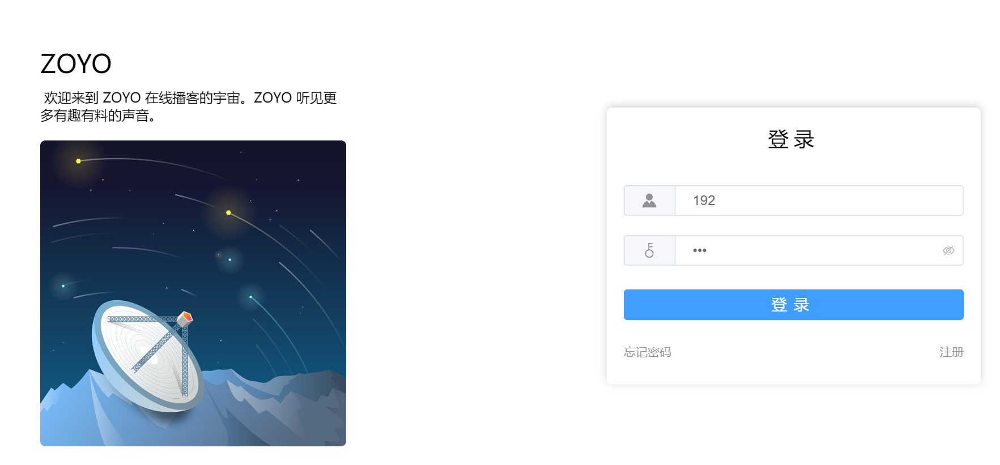
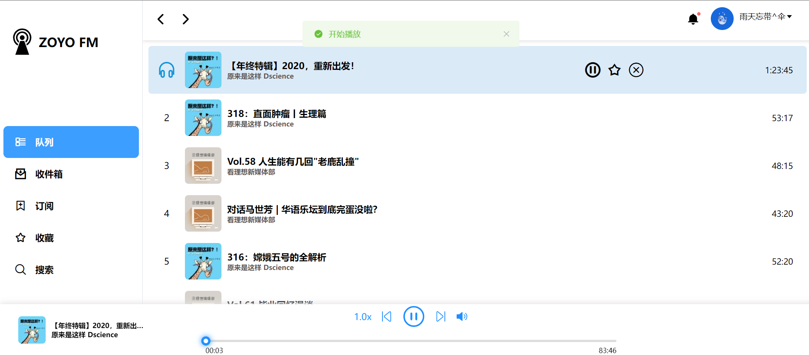
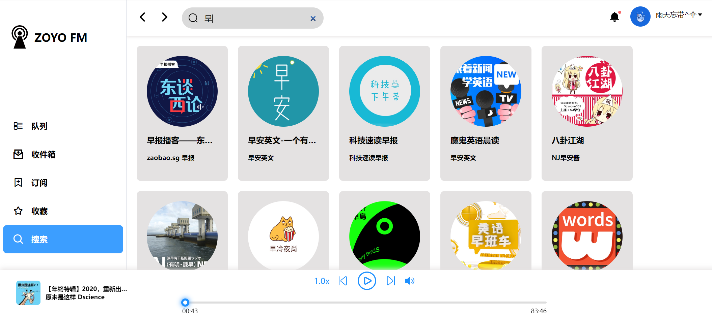
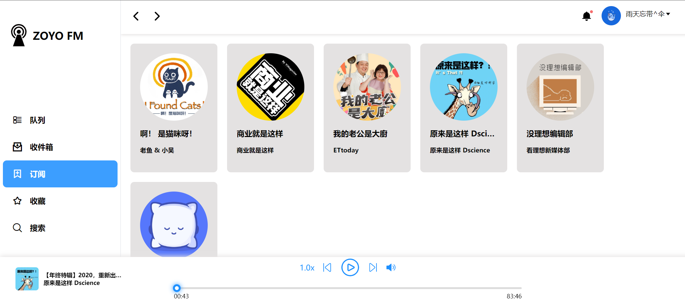

# zoyo-web

## 项目介绍

`ZOYO WEB`播客项目是前后端分离的网页版的播客项目，该项目的目标是实现在网页端收听播客节目。前端基于 Vue3框架和 Element-Plus 组件实现，服务端基于 Spring Boot 和 Mybatis-Plus 等框架实现。

注：在该项目中参考了[mall](https://github.com/macrozheng/mall)、[vue3-element-admin](https://gitee.com/asaasa/vue3-element-admin)、[maku-admin](https://gitee.com/makunet/maku-admin)、[vue-element-admin](https://github.com/PanJiaChen/vue-element-admin)等开源项目，前端页面模仿[Podcasts播客](https://chrome.google.com/webstore/detail/podcasts-a-player-downloa/lmpfkgigdbnbdopkpeippmadlchmkphi)，播放控件使用了[vue-audio-player](https://github.com/1014156094/vue-audio-player)开源组件。

## 项目演示

[后端项目](https://github.com/way-s/zoyo-podcast)

前端启动地址：http://localhost:8080/

1. 登录页
   1. 地址：http://localhost:8080/into

2. 播放列表页面
   1. 地址：http://localhost:8080/list

3. 搜索页面
   1. 地址：http://localhost:8080/search

4. 订阅列表页面
   1. 地址：http://localhost:8080/library

## 项目技术栈

### 1 后端技术

| 技术           | 说明                |
| -------------- | ------------------- |
| Spring boot    | 容器框架            |
| SpringSecurity | 认证和授权框架      |
| MyBatis        | orm框架             |
| MyBatis-Plus   | orm框架             |
| RabbitMQ       | 消息队列            |
| MySql          | 关系型数据库        |
| Redis          | 缓存数据库          |
| Druid          | 数据库连接池        |
| JWT            | 跨域认证            |
| Hutool         | java工具库          |
| rome           | RSS聚合而开发工具库 |
| netty-socketio | 基于netty的通信框架 |

### 2 前端技术

| 技术                                                         | 说明                                      |
| ------------------------------------------------------------ | ----------------------------------------- |
| Vue3                                                         | 前端框架                                  |
| Vuex                                                         | 全局状态管理框架                          |
| Element-Plus                                                 | vue3 ui组件库                             |
| Axios                                                        | 前端HTTP框架                              |
| [vue-audio-player](https://github.com/1014156094/vue-audio-player) | 音频播放控件                              |
| mitt                                                         | 事务总线库                                |
| socket.io-client                                             | Socket.io库，实现客户端和服务器的双向通信 |
| js-md5                                                       | md5加密库                                 |

